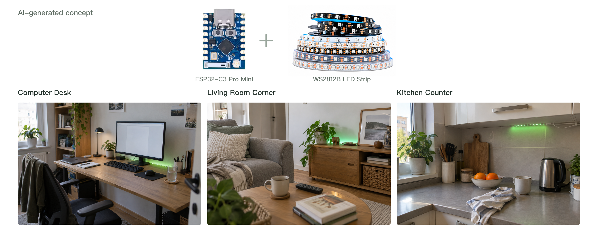
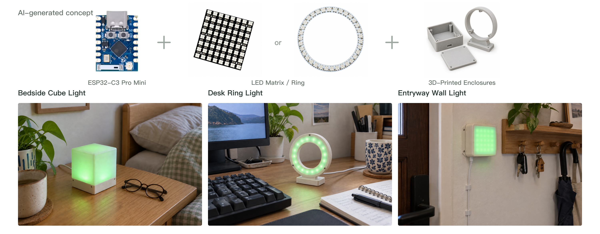
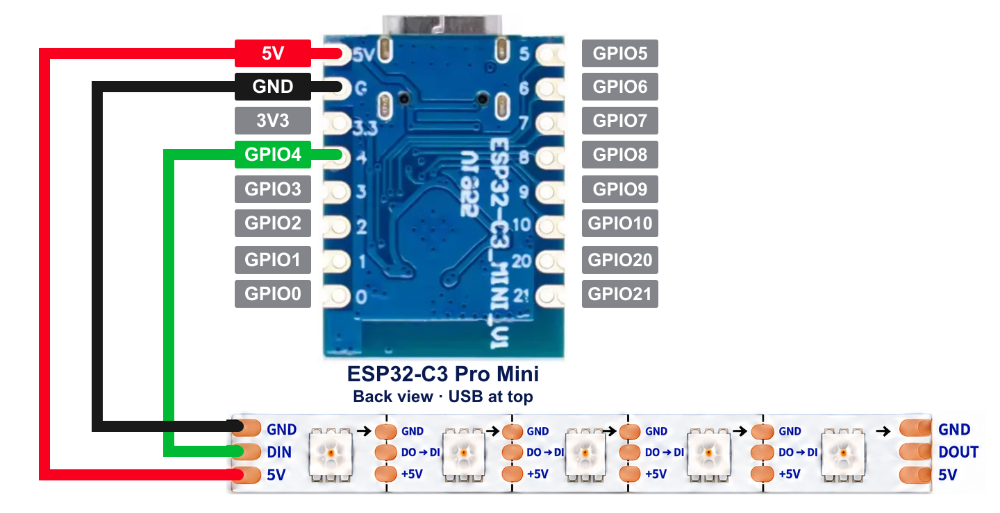
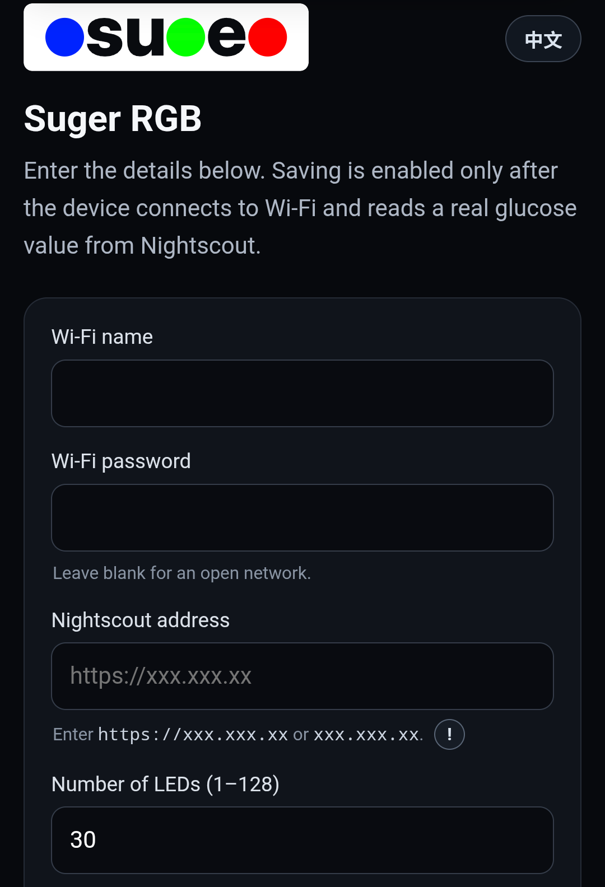

<p align="center">
  
</p>

<h1 align="center">Suger RGB</h1>

## ⚠️ DO NOT USE ESP32-C3 SUPER MINI — USE ESP32-C3 PRO MINI

> [!WARNING]
> **Do not buy or use an ESP32-C3 Super Mini (SuperMini) for this project.** These boards may have unreliable Wi-Fi, an undiscoverable setup hotspot, or failed Wi-Fi setup. A successful firmware flash does not guarantee working Wi-Fi.
>
> These issues occurred during this project's testing and were resolved by switching to an **ESP32-C3 Pro Mini**. **Choose the ESP32-C3 Pro Mini for this project.**

<p align="center">Turn Nightscout glucose and trend data into light you can understand at a glance.</p>

<p align="center">
  <a href="README.md">简体中文</a> · <strong>English</strong>
</p>

<p align="center">
  <a href="https://rgb.sidluo.com/installer/"><strong>Web installer</strong></a>
  · <a href="https://rgb.sidluo.com/demo/"><strong>Effect demo</strong></a>
  · <a href="docs/GUIDE.en.md"><strong>Full guide</strong></a>
</p>

Suger RGB is an open-source glucose indicator built with an ESP32-C3 Pro Mini, WS2812B LEDs, and Nightscout. It reads the latest glucose value once per minute, uses color for the glucose range, and changes the light effect with the glucose trend.

P.S. If you don't use Nightscout (~~even if you already do, you can still take a look~~), my other open-source project, [Nightscout for Cloudflare](https://github.com/sid-luo/nightscout-for-cloudflare#rgb), lets you deploy Nightscout completely free of charge in your own Cloudflare account. Completely free, and it takes only a few minutes to deploy.

This project aims to provide a low-cost way to help observe glucose trends. Search for `esp32-c3-mini-pro` and `ws2812b` on AliExpress, and you'll find plenty of affordable options. My skills are limited, and I don't currently have a 3D-printable model of my own. I only have one downloaded from [here](https://makerworld.com/zh/models/2008412-case-for-esp32-c3-pro-mini-esp32-c3fh4#profileId-2163305), which just about works for an LED strip. I'd appreciate support from more experienced makers.

When using a CGM, I often receive an alert only after my glucose has already gone high or low. After years of managing my glucose, I believe that seeing glucose trends “passively” is a very important part of the process. By the time I receive an alert from the CGM app, it may already be too late. Noticing changes in the light out of the corner of my eye can help me intervene earlier and try to avoid high or low glucose.





> [!IMPORTANT]
> Suger RGB is an open-source, community-based DIY project. It is not supported by any company and is not officially approved or regulated for diabetes therapy. You are responsible for building and running the device and use it at your own risk.

## What it shows

| mmol/L | mg/dL | Color |
| ---: | ---: | --- |
| `<3.5` | `<63` | Purple |
| `3.5–<4.4` | `63–79` | Blue |
| `4.4–<8.5` | `80–152` | Green |
| `8.5–<10` | `153–179` | Orange |
| `≥10` | `≥180` | Red |

The light effect changes with the Nightscout glucose trend. Open the [effect demo](https://rgb.sidluo.com/demo/) to see each glucose and arrow combination directly.

- A white breathing light appears when no valid new reading has arrived for 10 minutes
- The phone setup page supports Chinese, English, and live effect preview on the LEDs
- Works with 1–128 WS2812B pixels in a strip, ring, or panel

## What you need

### ⚠️ REMINDER: DO NOT BUY ESP32-C3 SUPER MINI

**Buy an ESP32-C3 Pro Mini. Super Mini boards may have Wi-Fi problems; do not use them for this project.**

| Part | Requirement |
| --- | --- |
| Controller | ESP32-C3 Pro Mini |
| LEDs | WS2812B strip, ring, or panel with 1–128 pixels |
| USB | A USB data cable and 5 V / 2 A power source |
| Network | 2.4 GHz Wi-Fi and an anonymously readable Nightscout site |


Original board photo: front on the left, back on the right.

**Optional board enclosure**: [Original STL (body + lid)](docs/models/esp32-c3-pro-mini/Case_ESP32-C3_PRO_MINI_V01.stl) · [Body only](docs/models/esp32-c3-pro-mini/Case_ESP32-C3_PRO_MINI_V01_Body.stl) · [Lid only](docs/models/esp32-c3-pro-mini/Case_ESP32-C3_PRO_MINI_V01_Lid.stl). If your printing service does not accept the combined file, upload the body and lid separately. See the [model notes](docs/models/esp32-c3-pro-mini/README.en.md) for the designer, source, and license.

## Wiring



The wiring diagram shows the **back of the board with USB at the top**. Connect **5V → 5V, GND → GND, GPIO4 → DIN**. Follow the labels on your actual strip; pad order can vary.

```text
ESP32-C3 Pro Mini          WS2812B

5V    -------------------- 5V
GND   -------------------- GND
GPIO4 -------------------> DIN
```

Connect the data wire to `DIN`, not `DOUT`.


## Get started

1. Connect the three wires above, then connect the ESP32-C3 Pro Mini over USB.
2. Open the [web installer](https://rgb.sidluo.com/installer/) in desktop Chrome or Edge and install the firmware.
3. Join the open `Suger-RGB-XXXX` Wi-Fi network on your phone.
4. Enter home Wi-Fi, the Nightscout address, and the LED count, then validate and save.
5. After restarting, the device reads Nightscout and displays the light automatically.

**Phone setup page**



To change the setup later, hold the board's BOOT button for about five seconds. See the [full user guide](docs/GUIDE.en.md) for every step and troubleshooting.

## Documentation

- [Full user guide](docs/GUIDE.en.md)
- [Interactive effect demo](https://rgb.sidluo.com/demo/)

## License and credits

Suger RGB is released under the [GNU GPL v3.0 or later](LICENSE). Some effects are adapted from MIT-licensed [WLED v0.14.4](https://github.com/wled/WLED/tree/v0.14.4). See [THIRD_PARTY_NOTICES.md](THIRD_PARTY_NOTICES.md) for complete source and copyright notices.

The board enclosure model is by Mattia Carli. The original and split STL files are separately licensed under [CC BY-NC-SA 4.0](https://creativecommons.org/licenses/by-nc-sa/4.0/).

Thanks to the [Nightscout](https://nightscout.github.io/) community, the WLED project, and every open-source contributor.
