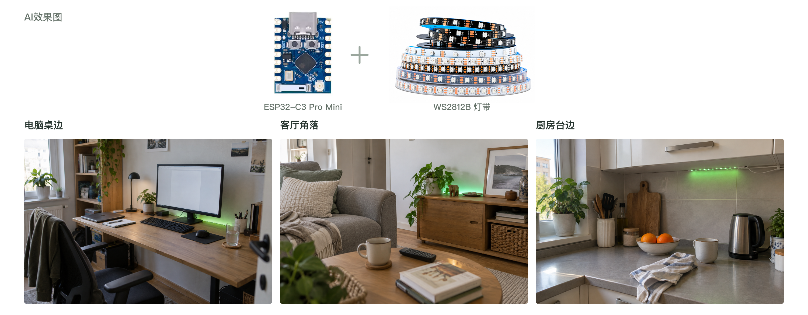
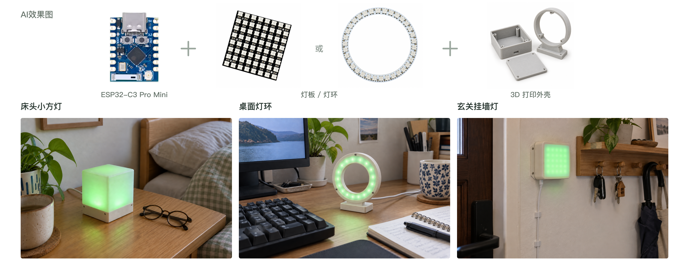
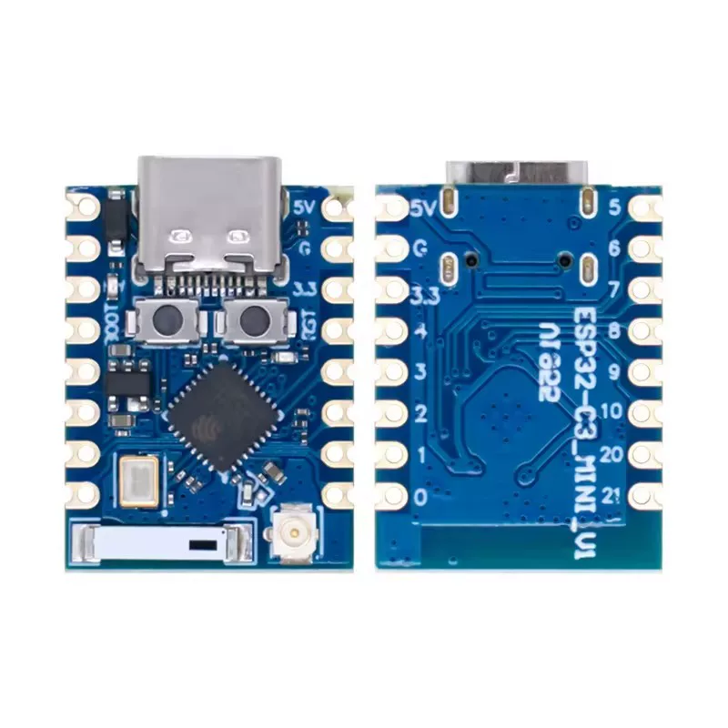
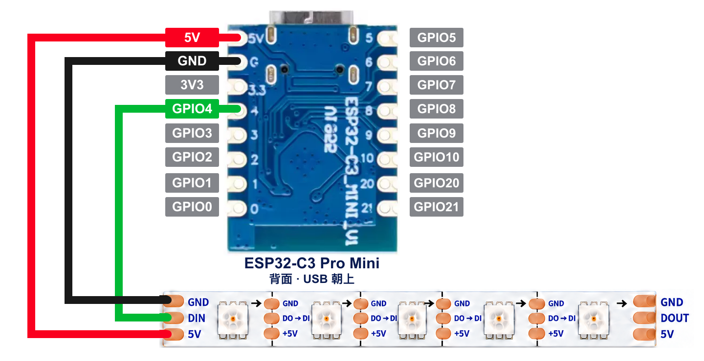
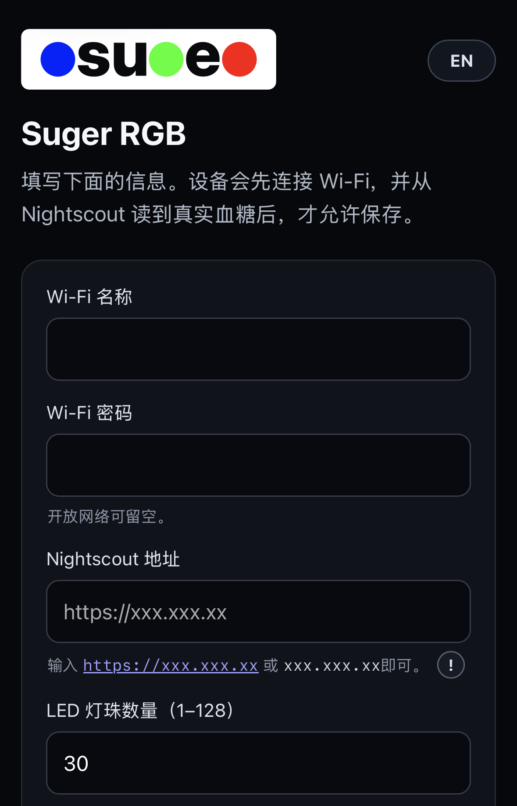

<p align="center">
  
</p>

<h1 align="center">Suger RGB</h1>

## ⚠️ 不要使用 ESP32-C3 Super Mini，请使用 ESP32-C3 Pro Mini

> [!WARNING]
> **请勿购买或使用 ESP32-C3 Super Mini（SuperMini）制作本项目。** 这类板子可能出现 Wi-Fi 不稳定、搜不到配网热点或配网失败等问题，即使固件刷写成功也可能无法正常联网。
>
> 本项目实测曾遇到上述问题，换用 **ESP32-C3 Pro Mini** 后恢复正常。**请直接选用 ESP32-C3 Pro Mini。**

<p align="center">把 Nightscout 血糖和走势，变成一眼就能看懂的灯光。</p>

<p align="center">
  <strong>简体中文</strong> · <a href="README.en.md">English</a>
</p>

<p align="center">
  <a href="https://rgb.sidluo.com/installer/"><strong>网页安装</strong></a>
  · <a href="https://rgb.sidluo.com/demo/"><strong>灯效演示</strong></a>
  · <a href="docs/GUIDE.md"><strong>完整教程</strong></a>
</p>

Suger RGB 是一个使用 ESP32-C3 Pro Mini、WS2812B 和 Nightscout 制作的开源血糖提示灯。设备每分钟读取一次最新血糖，用颜色表示区间，并根据血糖走势改变灯效。

PS：如果你没有使用 Nightscout（~~就算正在使用也可以看一下~~），我另外一个开源项目 [Nightscout for Cloudflare](https://github.com/sid-luo/nightscout-for-cloudflare#rgb)：完全免费部署在自己 Cloudflare 账户上的 Nightscout。完全免费，几分钟就能部署好。

本项目旨在用低成本的方案辅助观察血糖走势。在淘宝搜索 `esp32-c3-mini-pro` 和 `ws2812b`，就有很多选择，而且价格实惠。小弟能力有限，目前没有 3D 打印模型，只有一个在[这里](https://makerworld.com/zh/models/2008412-case-for-esp32-c3-pro-mini-esp32-c3fh4#profileId-2163305)下载的，做灯带的话勉强能用。希望大佬们多多支持。

在使用 CGM 的时候，经常是发生高血糖或低血糖才收到提示。在多年控糖经历中，“被动”看到血糖走势，我认为是非常重要的一环。接收到 CGM 软件提示的时候，可能已经就迟了。无意中余光看到灯光的变化，可以尽早干预，争取避免高／低血糖。





> [!IMPORTANT]
> Suger RGB 是一个开源社区 DIY 项目，不由任何公司提供正式支持，也未获批准或受监管用于糖尿病治疗。用户须自行负责设备的搭建与运行，并自行承担使用风险。

## 功能简介

| mmol/L | mg/dL | 颜色 |
| ---: | ---: | --- |
| `<3.5` | `<63` | 紫色 |
| `3.5–<4.4` | `63–79` | 蓝色 |
| `4.4–<8.5` | `80–152` | 绿色 |
| `8.5–<10` | `153–179` | 橙色 |
| `≥10` | `≥180` | 红色 |

灯效会根据 Nightscout 的血糖走势动态改变。可以先打开[灯效演示](https://rgb.sidluo.com/demo/)，直接查看不同血糖和箭头的显示效果。

- 10 分钟没有有效新数据时显示白色呼吸灯
- 手机配网页支持中文、英文和实体灯效预览
- 支持 1–128 颗 WS2812B 灯珠，可使用灯带、灯环或灯板

## 需要准备

### ⚠️ 再次提醒：不要购买 ESP32-C3 Super Mini

**请购买 ESP32-C3 Pro Mini。Super Mini 可能存在 Wi-Fi 问题，请勿将其用于本项目。**

| 部件 | 要求 |
| --- | --- |
| 主控 | ESP32-C3 Pro Mini |
| 灯 | WS2812B 灯带、灯环或灯板，1–128 颗 |
| USB | 支持数据传输的 USB 线和 5V 2A 电源 |
| 网络 | 2.4 GHz Wi-Fi，以及可匿名读取的 Nightscout |



主板原图：左侧为正面，右侧为背面。

**主板保护壳（可选）**：[原版 STL（盒体＋盖子）](docs/models/esp32-c3-pro-mini/Case_ESP32-C3_PRO_MINI_V01.stl) · [单独盒体](docs/models/esp32-c3-pro-mini/Case_ESP32-C3_PRO_MINI_V01_Body.stl) · [单独盖子](docs/models/esp32-c3-pro-mini/Case_ESP32-C3_PRO_MINI_V01_Lid.stl)。打印平台不接受组合文件时，分别上传盒体和盖子。作者、来源与许可见[模型说明](docs/models/esp32-c3-pro-mini/README.md)。

## 接线



接线图采用**主板背面视角，USB 接口朝上**。连接 **5V → 5V、GND → GND、GPIO4 → DIN**。灯带焊盘顺序可能不同，请以实物丝印为准。

```text
ESP32-C3 Pro Mini          WS2812B

5V    -------------------- 5V
GND   -------------------- GND
GPIO4 -------------------> DIN
```

灯的数据线应连接 `DIN`，不要连接 `DOUT`。


## 开始使用

1. 按上图接好三条线，并用 USB 连接 ESP32-C3 Pro Mini。
2. 用桌面版 Chrome 或 Edge 打开[网页安装器](https://rgb.sidluo.com/installer/)并写入固件。
3. 手机连接无密码热点 `Suger-RGB-XXXX`。
4. 填写家庭 Wi-Fi、Nightscout 地址和灯珠数量，然后验证并保存。
5. 设备重启后会自动读取 Nightscout 并显示灯光。

**手机配网页**



以后需要修改设置时，长按开发板上的 BOOT 约 5 秒即可重新进入配网。完整步骤和故障排查见[详细使用教程](docs/GUIDE.md)。

## 文档

- [详细使用教程](docs/GUIDE.md)
- [灯效在线演示](https://rgb.sidluo.com/demo/)

## License 与致谢

Suger RGB 按 [GNU GPL v3.0 或更高版本](LICENSE)发布。部分灯效改编自 MIT 许可的 [WLED v0.14.4](https://github.com/wled/WLED/tree/v0.14.4)，完整来源与版权说明见 [THIRD_PARTY_NOTICES.md](THIRD_PARTY_NOTICES.md)。

主板保护壳模型由 Mattia Carli 制作，原版及拆分文件单独遵循 [CC BY-NC-SA 4.0](https://creativecommons.org/licenses/by-nc-sa/4.0/) 许可。

感谢 [Nightscout](https://nightscout.github.io/) 社区、WLED 项目及所有开源贡献者。
