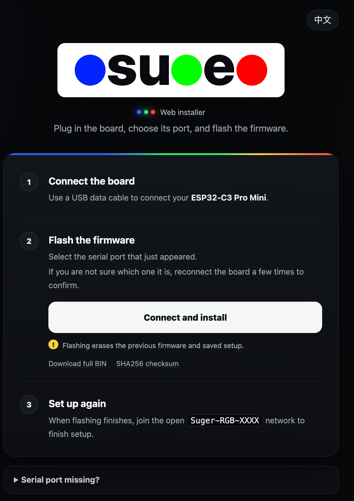
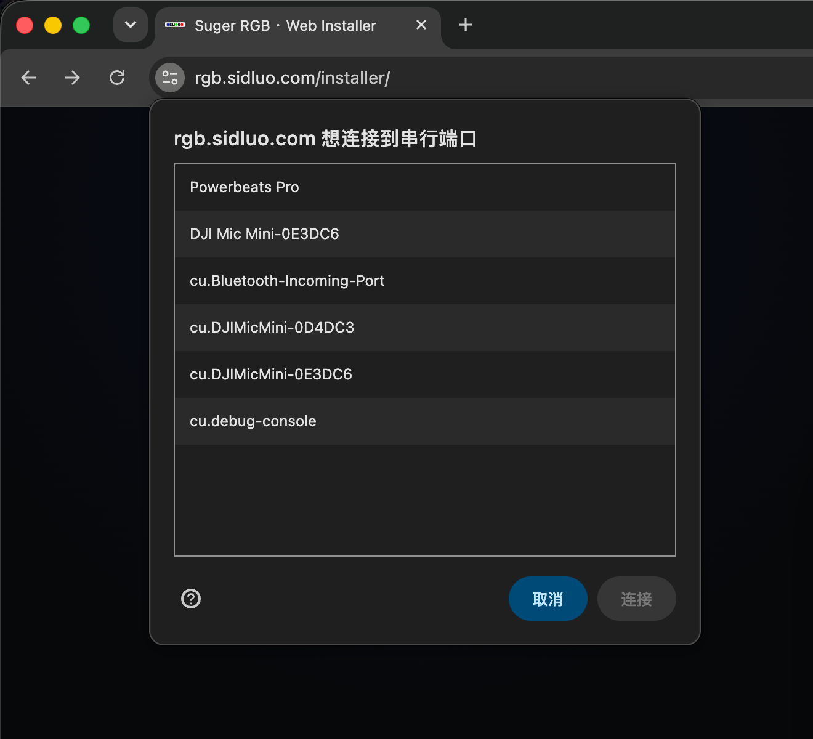
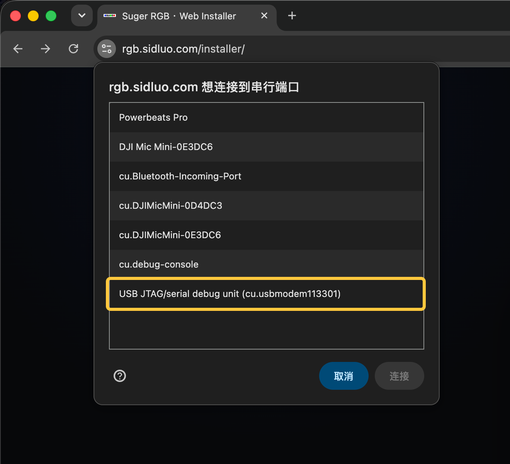
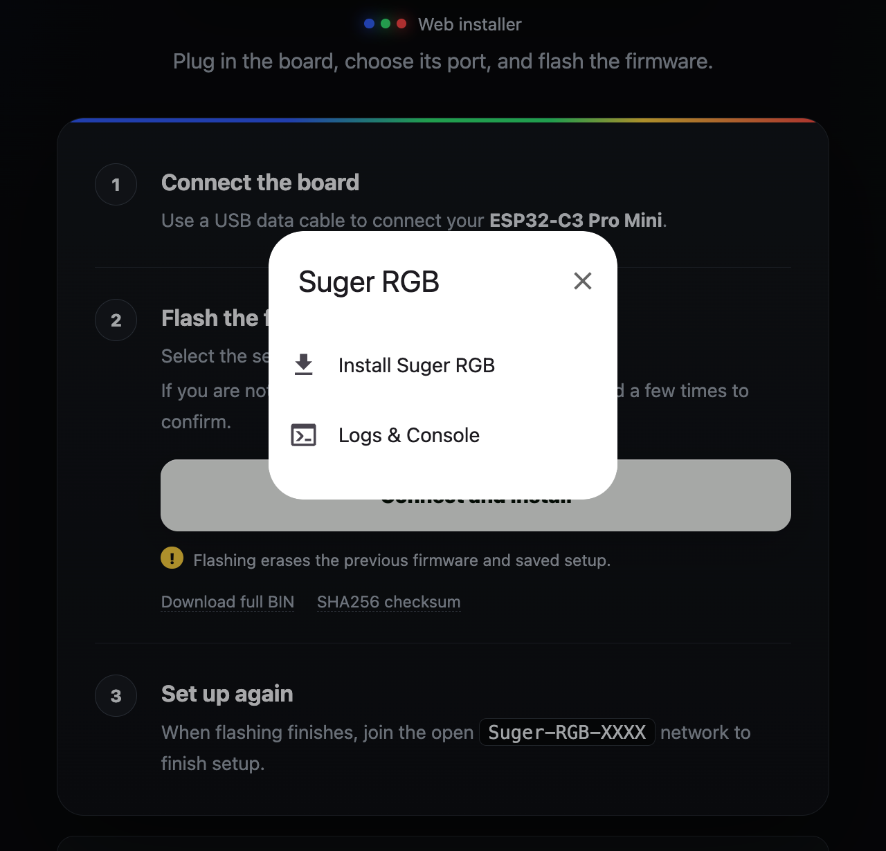
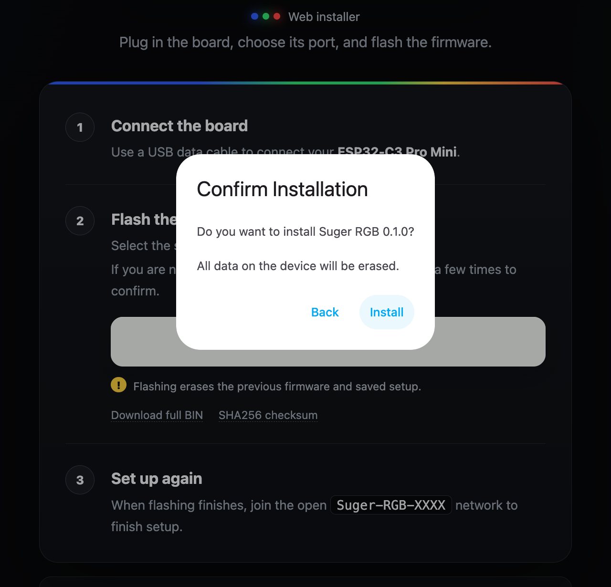
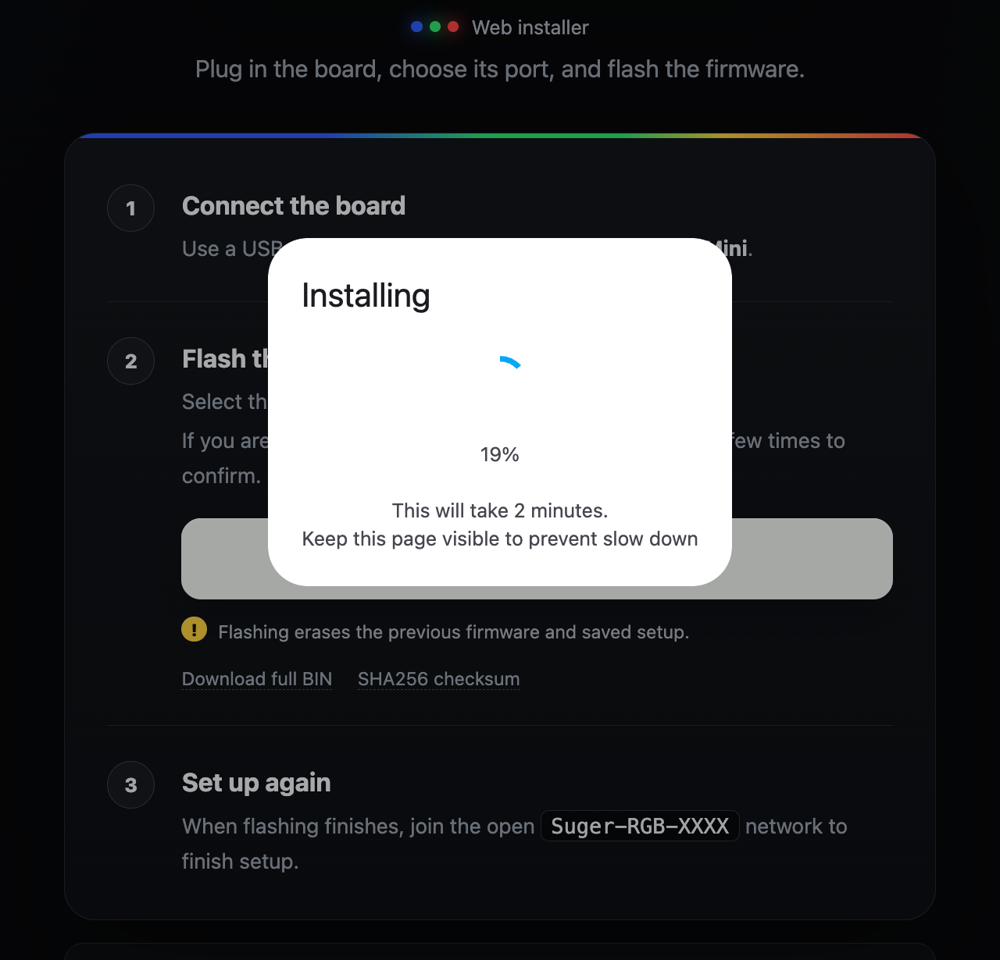
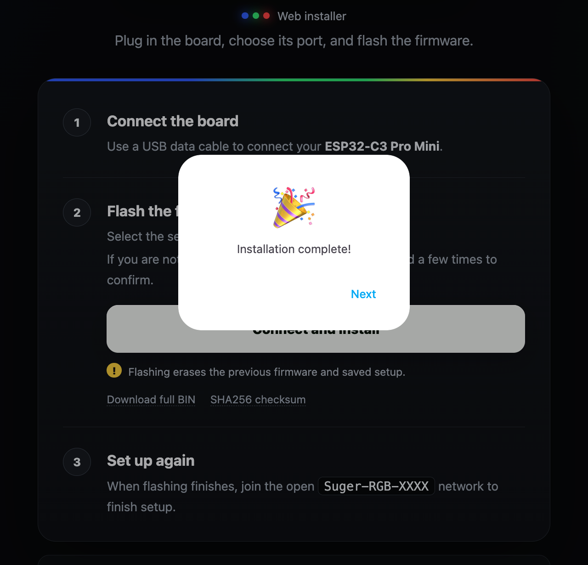
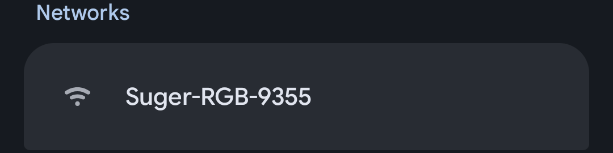
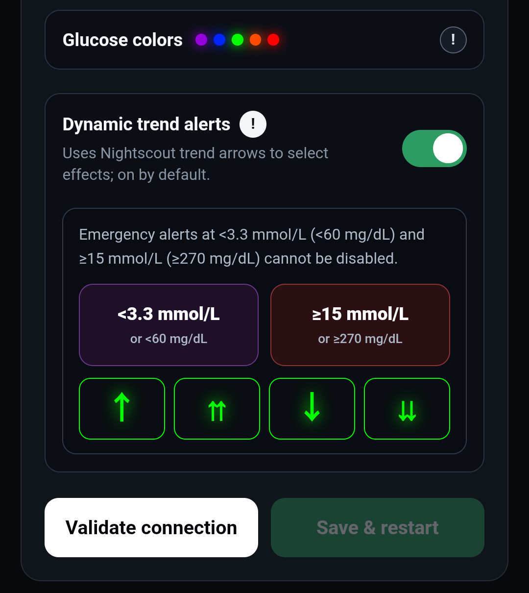
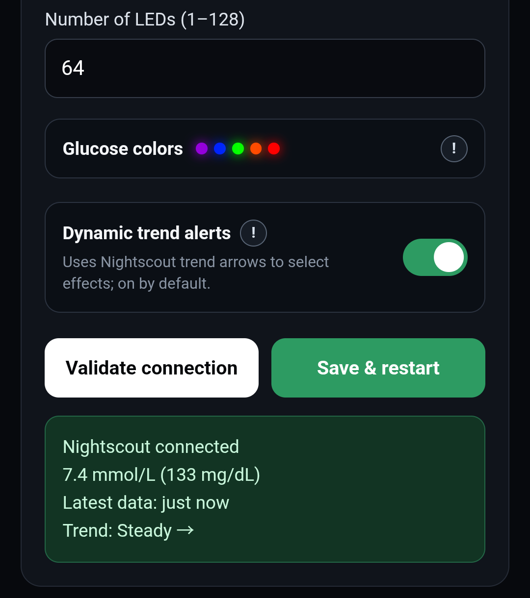

# Suger RGB User Guide

[简体中文](GUIDE.md) · [Project home](../README.en.md) · [Web installer](https://rgb.sidluo.com/installer/)

For your first build, follow this order: **gather the parts → connect the wires → flash from a computer → set up from a phone → place the device where you want to use it.** You do not need a development environment or any code changes.

If your device is already working and you only want to change Wi-Fi or other settings, go to [Change settings](#change-settings). For help with a problem, see [Troubleshooting](#troubleshooting).

## ⚠️ DO NOT USE ESP32-C3 SUPER MINI — USE ESP32-C3 PRO MINI

> [!WARNING]
> **Do not buy or use an ESP32-C3 Super Mini (SuperMini) for this project.** During this project's testing, these boards had problems such as a missing setup hotspot and unstable Wi-Fi. Switching to an **ESP32-C3 Pro Mini** resolved them. A successful firmware flash does not establish that the wireless connection works correctly.

> [!IMPORTANT]
> Suger RGB is a community DIY project that turns existing CGM data into light. It cannot replace the original CGM readings, alarms, medical judgment, or treatment advice. You are responsible for building and using the device.

## 1. Gather the parts

| What you need | Requirements |
| --- | --- |
| Controller | **ESP32-C3 Pro Mini with 4 MB flash** |
| LEDs | A **5 V WS2812B** strip, ring, or matrix with 1–128 LEDs |
| Wiring materials | Three wires for 5V, GND, and data input; soldering or connection materials appropriate for your board and LEDs |
| USB data cable | Must carry data, not just power |
| Computer | For browser flashing; desktop Chrome or Edge is recommended |
| Phone | To join the device's hotspot and enter settings |
| Power source for everyday use | USB 5 V / 2 A power supply |
| Home network | A 2.4 GHz Wi-Fi network that can reach Nightscout |
| Nightscout | An HTTPS site receiving glucose data and allowing anonymous access to that data |

Search for `esp32-c3-mini-pro` and `ws2812b` on AliExpress to find the parts. **Check again that you are buying a Pro Mini, not a Super Mini.**

If you do not have Nightscout yet, take a look at [Nightscout for Cloudflare](https://github.com/sid-luo/nightscout-for-cloudflare#rgb). The current firmware has no API_SECRET or Token field, so it cannot read data from a site that requires a secret or token.

You can add an enclosure after the device is working. Count the LEDs first, and use your phone's normal Internet connection to check that Nightscout is receiving new data.

The front is on the left and the back is on the right. The wiring diagram below shows the **back of the board, with the USB connector at the top**.

## 2. Connect the three wires

**Disconnect USB and any other power source before wiring.**

| Board pin | Connect to the LEDs | Purpose |
| --- | --- | --- |
| `5V` | `5V` or `+5V` | Positive power connection |
| `GND` | `GND` or `G` | Common ground |
| `GPIO4` (marked `4` on the board) | `DIN` or `DI` | Data input |

The arrows on a strip show the direction of data flow: data enters `DIN` from the controller, then passes to the following LEDs. `DOUT` or `DO` is the output and cannot be used as the input. **Pad positions can vary. Follow the printed labels on your actual LEDs, rather than assuming a connection belongs at the top or bottom.**

Rings and matrices use the same three connections. Check for loose connections and solder bridging adjacent pads, then connect the board to your computer with a USB data cable.

View the complete pinout and LED strip reference photo

### Wiring photos

**Board wiring close-up**

**Board and cable**

**Board and LED strip assembly**

## 3. Flash the firmware from a computer

Open the [Suger RGB web installer](https://rgb.sidluo.com/installer/) in Chrome or Edge on your computer.

### 3.1 Open the installer

Connect your **ESP32-C3 Pro Mini** using a USB **data cable**, then click **Connect and install**.

### 3.2 Identify the board's serial port

If several ports are listed, use this comparison **before starting installation**:

1. Unplug the board and check the list.
2. Reconnect it and look for the entry that appears again. If the list does not refresh, cancel the dialog and click **Connect and install** again.
3. Select that entry, then click **Connect**.

| Board unplugged | Board reconnected |
| --- | --- |
|  |  |
| No entry for the board. | A new **USB JTAG/serial debug unit** entry appears. |

In these macOS screenshots, the port is `USB JTAG/serial debug unit (cu.usbmodem113301)`. Its name and number may differ on your computer; identify it by unplugging and reconnecting the board, rather than matching this number.

The browser's port-selection dialog is shown in Chinese here: **连接 = Connect**, **取消 = Cancel**. Its language follows the browser, so switching the installer page to English may not change this dialog.

### 3.3 Choose Install Suger RGB

Once the board is connected, click **Install Suger RGB** in the menu.

### 3.4 Confirm installation

Click **Install** in the confirmation dialog. **This erases the previous firmware and saved setup information.**

### 3.5 Wait for the firmware to be written

Keep the page visible and the USB cable connected while the progress indicator runs. Wait until the installer reports completion.

### 3.6 Check that installation is complete

When **Installation complete!** appears, click **Next** and allow the board to restart.

The board then enters setup mode. With the LEDs wired correctly, they show a dim white chase. Continue with [phone Wi-Fi setup](#4-set-up-the-device-from-your-phone) and look for the open `Suger-RGB-XXXX` network.

If the serial port cannot be opened, see [Serial port will not open](#serial-port-will-not-open).

## 4. Set up the device from your phone

### Join the device's hotspot

A device without complete saved setup information enters setup mode automatically on startup. If it has already been configured, first [hold BOOT to enter setup mode](#change-settings).

1. Open your phone's Wi-Fi settings and join **`Suger-RGB-XXXX`**. The final characters vary by device. The hotspot has no password.
2. If your phone warns that the network has no Internet connection, choose to stay connected. Your phone is connecting directly to the lamp's setup page.
3. Wait for the setup page to appear. If it does not open automatically, stay connected to the hotspot and enter **`http://192.168.4.1/`** in your browser's address bar.

The device hotspot is available in the Wi-Fi list below. Tap **`Suger-RGB-XXXX`** to connect.

### Enter the settings

Use the button at the top right of the setup page to switch between Chinese and English.

| Field or option | What to enter or choose |
| --- | --- |
| Wi-Fi name | The name of your home **2.4 GHz Wi-Fi** network, not `Suger-RGB-XXXX` |
| Wi-Fi password | The password for that home network; leave blank for an open network |
| Nightscout address | For example, `https://example.com`; `example.com` also works |
| Number of LEDs (1–128) | The total number of connected LEDs; for example, enter `64` for an 8×8 matrix |
| Dynamic trend alerts | On by default; when off, the ordinary glucose ranges use a steady color |

You do not need to add the Nightscout API path yourself. The device adds it automatically. The current firmware supports HTTPS only.

The dynamic trend switch does not disable the special effects for very low or very high glucose. See [What the lights mean](#5-what-the-lights-mean).

### Test the light effects

Tap **the `!` next to “Dynamic trend alerts”** to expand the test panel. Tap a low/high glucose card or a trend arrow to preview its effect on the LEDs. Tap `!` again to close the panel and stop the preview.

Testing previews the light effects only; it does not change glucose records in Nightscout.

### Validate and save

1. Select **“Validate connection”**. The device tries to connect to your home Wi-Fi and requests glucose data from Nightscout.
2. After validation succeeds, the page shows the glucose reading, data age, and trend. Check that these are what you expect.

3. Select **“Save & restart”**. Validation alone does not save the setup.
4. Wait for the device to restart. Your phone can return to its usual Wi-Fi network.

**What you should see:** the device connects to your home Wi-Fi and shows the glucose color and trend effect after reading valid data. The setup hotspot and page close during normal operation.

If the page reports that the data is more than 10 minutes old, the LEDs will show a white breathing effect even if you can save. Check that Nightscout is receiving new data first.

## 5. What the lights mean

The device reads Nightscout about once per minute. The lights reflect records that Nightscout has already received, so delays in CGM uploads or the network also affect the display.

### Glucose colors

| mmol/L | mg/dL | Color |
| ---: | ---: | --- |
| `<3.5` | `<63` | Purple |
| `3.5–<4.4` | `63–79` | Blue |
| `4.4–<8.5` | `80–152` | Green |
| `8.5–<10` | `153–179` | Orange |
| `≥10` | `≥180` | Red |

### Trend effects

With “Dynamic trend alerts” enabled, the ordinary glucose ranges use these effects:

| Nightscout trend | Light effect |
| --- | --- |
| `↑` Rising | Gentle breathing in the current glucose color |
| `⇈` Rising quickly | Faster breathing |
| `↓` Falling | Reverse gradual fill |
| `⇊` Falling quickly | Reverse comet |
| `→`, `↗`, `↘`, or another trend | Steady light in the current glucose color |

### Special displays

| State | Light effect |
| --- | --- |
| Glucose below `60 mg/dL` (about `3.3 mmol/L`) | Purple double pulse, overriding ordinary trend effects |
| Glucose at or above `270 mg/dL` (`15 mmol/L`) | Multicolor twinkling (Twinklefox), overriding ordinary trend effects |
| Just started and has not read data yet, or the data has expired | White breathing |
| Setup mode | Dim white chase |
| Clearing connection information | Three slow white pulses |

The special effects for very low and very high glucose remain enabled even when dynamic trend alerts are off. White breathing is not a glucose range color; during normal operation, data that has not been updated for more than 10 minutes triggers this state.

After saving the settings, you can disconnect the computer and use your everyday USB power source. Removing power does not clear the settings. On the next startup, the device reconnects to the saved home Wi-Fi network.

## 6. Change settings or set up again

### Change settings

To change your home Wi-Fi, Nightscout address, LED count, or dynamic trend setting:

1. Power the device normally.
2. Hold the board's **BOOT button for about five seconds**, then release it when you see the white chase.
3. Join `Suger-RGB-XXXX` on your phone and open the setup page or `http://192.168.4.1/`.
4. Change the settings, select **“Validate connection”** again, then **“Save & restart”**.

If the Wi-Fi name is unchanged, leaving the password field blank keeps the saved password. When switching to a different password-protected network, enter its password.

During normal operation, the device's IP address on your home network does not provide a settings page. Use the physical BOOT button to enter setup mode first.

### Clear saved connection information

Use these steps only when you want to clear the home Wi-Fi and Nightscout address:

1. Enter setup mode as described above, then **fully release BOOT**.
2. Hold BOOT again for about five seconds. Release it when you see the three slow white pulses.
3. The device clears the connection information, restarts, and enters setup mode again.

The LED count and dynamic trend setting are preserved. These are two separate long presses; one continuous press cannot trigger both setup mode and clearing connection information.

## 7. Optional: print a board enclosure

Once wiring, flashing, and Wi-Fi setup are working, you can add an enclosure for the controller board.

The model is by **Mattia Carli**, available on [MakerWorld](https://makerworld.com/zh/models/2008412-case-for-esp32-c3-pro-mini-esp32-c3fh4#profileId-2163305). The original STL contains both the body and the lid. This project also provides them as separate files:

- [Original: body and lid in one file](models/esp32-c3-pro-mini/Case_ESP32-C3_PRO_MINI_V01.stl)
- [Body only](models/esp32-c3-pro-mini/Case_ESP32-C3_PRO_MINI_V01_Body.stl)
- [Lid only](models/esp32-c3-pro-mini/Case_ESP32-C3_PRO_MINI_V01_Lid.stl)

If your printing service does not accept the combined file, upload the body and lid separately and print one of each. This model holds the controller board only. See the [model notes](models/esp32-c3-pro-mini/README.en.md) for dimensions, changes in the split files, and the original license.

## Troubleshooting

### Serial port will not open

`Failed to execute 'open' on 'SerialPort'` means the browser could not open the serial port. This can happen before writing or while reconnecting after writing, so the error alone does not tell you whether firmware was written.

1. Close the installation dialog and any other flashing pages or serial tools connected to the board.
2. Unplug the board, reconnect it to the computer, select “Connect and install,” and choose the port again.
3. If it still fails, try a known working USB data cable connected directly to another USB port on the computer.

### The board is missing from the serial port list

First check that the USB cable carries data. If the port still does not appear, try entering flashing mode: unplug USB, hold BOOT while reconnecting USB, wait about two seconds, then release BOOT and select the port again.

This is a flashing recovery procedure. For everyday Wi-Fi setup, power the board normally first, then hold BOOT.

For more serial port, driver, and manual flashing instructions, see [installation and flashing troubleshooting](INSTALL.en.md).

### Cannot find `Suger-RGB-XXXX`

A configured device does not keep its hotspot open during normal startup. Power it normally, hold BOOT for about five seconds, release it, and scan for Wi-Fi networks again on your phone.

If the hotspot is still missing, confirm that the board is a **Pro Mini**, move your phone closer, and try another phone. A white chase means the device is entering setup mode; the light effect alone does not prove that the hotspot is broadcasting successfully.

If the hotspot appears with computer power but not with an external supply, use the same cable to compare the two power sources. Then try a known working power supply and cable to help narrow down the cause.

### The phone joins the hotspot, but the page will not open

Check that the phone is still connected to `Suger-RGB-XXXX` and has not switched back to your home Wi-Fi. If needed, temporarily disable mobile data or automatic switching to a network with Internet access. Enter **`http://192.168.4.1/`** in the browser's address bar, not its search field.

### Validation fails, or the save button is disabled

Validation must succeed before you can save. Changing any setting requires validation again.

| Message | What to check first |
| --- | --- |
| Incorrect Wi-Fi name or password, or connection timeout | Check for a 2.4 GHz home network, correct name and password, and a signal within range of the device |
| `401` / `403` | Check that Nightscout allows anonymous data reads; being able to open the home page does not mean the data API allows anonymous access |
| Nightscout timeout or connection failure | Check the address, HTTPS certificate, and whether your home network can reach the site |
| No glucose data, or an old record | Check that the CGM is still uploading to Nightscout and that the latest record has the expected timestamp |

To check the Nightscout website from your phone, restore the phone's normal Internet connection first. Rejoin the device hotspot afterward to continue setup.

### No LEDs light up, or only some do

Disconnect power first. Check that `5V`, `GND`, and `GPIO4 → DIN` are connected correctly and securely. Power the device, open the setup page, and check the actual LED count. Before the first setup, the default is 30 LEDs; enter the actual count for a strip, ring, or matrix with more than 30 LEDs.

If a section still does not light up, check the connections before that section and the data direction. Do not use the LEDs' `DOUT` output as the input.

### The LEDs keep showing white breathing

Just after startup, the device may not have read its first record yet. If white breathing continues, check your home Wi-Fi and Nightscout. When the latest Nightscout record is more than 10 minutes old, restarting or reflashing cannot make that record current.

---

[Back to project home](../README.en.md) · [Web installer](https://rgb.sidluo.com/installer/) · [Installation and flashing troubleshooting](INSTALL.en.md)
