# Suger RGB 详细使用教程

[English](GUIDE.en.md) · [项目首页](../README.md) · [网页安装器](https://rgb.sidluo.com/installer/)

第一次制作，可以按下面的顺序完成：**准备材料 → 接线 → 用电脑刷写 → 用手机配网 → 放到日常使用的位置。** 不需要安装开发环境，也不需要修改代码。

已经做好设备、只想更换 Wi-Fi 或修改设置，可以直接看[修改设置](#修改设置)。遇到问题，可以跳到[常见问题](#常见问题)。

## ⚠️ 不要使用 ESP32-C3 Super Mini，请使用 ESP32-C3 Pro Mini

> [!WARNING]
> **请勿购买或使用 ESP32-C3 Super Mini（SuperMini）制作本项目。** 本项目实测曾遇到搜不到配网热点、Wi-Fi 连接不稳定等问题，换成 **ESP32-C3 Pro Mini** 后恢复正常。即使刷写成功，也不能据此判断无线连接正常。

> [!IMPORTANT]
> Suger RGB 是开源社区 DIY 项目，只把 CGM 已有的数据转换成灯光，不能替代 CGM 原始读数、报警、医疗判断或治疗建议。设备的搭建和使用由用户自行负责。

## 1. 准备材料

| 需要准备 | 具体要求 |
| --- | --- |
| 主板 | **ESP32-C3 Pro Mini，4 MB Flash** |
| 灯 | **5V WS2812B** 灯带、灯环或灯板，1–128 颗灯珠 |
| 接线材料 | 连接 5V、GND 和数据输入的三条线；按所购主板和灯具准备焊接或连接材料 |
| USB 数据线 | 能传输数据，不能只支持充电 |
| 电脑 | 用于网页刷写，建议使用桌面版 Chrome 或 Edge |
| 手机 | 用于连接设备热点、填写配置 |
| 日常电源 | USB 5V / 2A 电源 |
| 家庭网络 | 能访问 Nightscout 的 2.4 GHz Wi-Fi |
| Nightscout | 正在接收血糖数据的 HTTPS 站点，并允许匿名读取数据 |

在淘宝搜索 `esp32-c3-mini-pro` 和 `ws2812b` 可以找到对应材料。**请再次确认购买的是 Pro Mini，不是 Super Mini。**

还没有 Nightscout，可以先了解 [Nightscout for Cloudflare](https://github.com/sid-luo/nightscout-for-cloudflare#rgb)。当前固件没有 API_SECRET 或 Token 输入框，不能连接必须凭口令或 Token 才能读取数据的站点。

外壳可以在设备正常工作后再安装。先确认灯珠数量，并在手机正常联网时检查 Nightscout 是否正在更新。

上图左侧是正面，右侧是背面。下面的接线图使用**背面视角，USB 接口朝上**。

## 2. 接好三条线

**接线前先断开 USB 和其他电源。**

| 主板引脚 | 连接到灯具 | 用途 |
| --- | --- | --- |
| `5V` | `5V` 或 `+5V` | 供电正极 |
| `GND` | `GND` 或 `G` | 共地 |
| `GPIO4`（板上标为 `4`） | `DIN` 或 `DI` | 数据输入 |

灯带箭头表示数据传递方向：数据从主板进入 `DIN`，再向后面的灯珠传递。`DOUT` 或 `DO` 是输出端，不能代替输入端。**灯带焊盘的位置可能不同，按实物上的文字接线，不要只看焊盘在上面还是下面。**

灯环和灯板同样连接这三条线。检查接点是否牢固、相邻焊盘是否连锡，再用 USB 数据线连接电脑。

查看完整引脚图和灯带实物参考

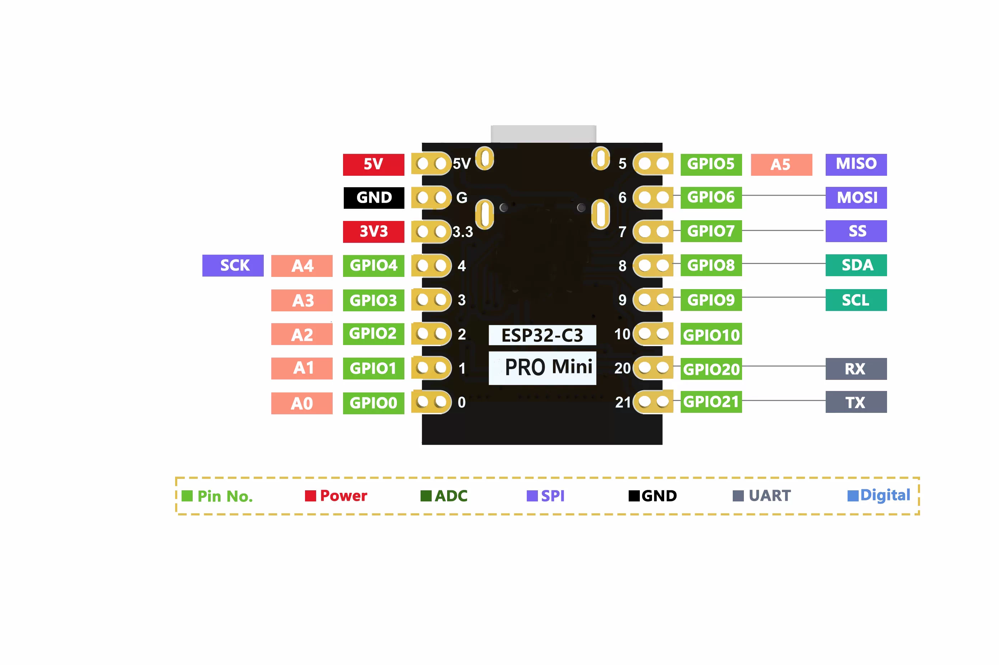

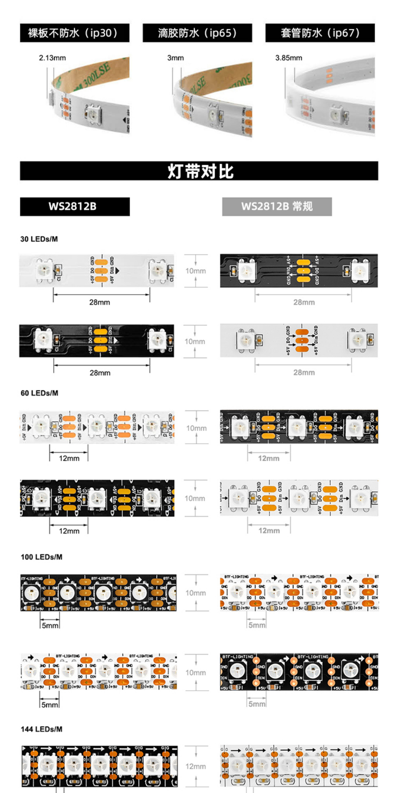

### 实物接线参考

**主板接线近照**

**主板与连接线**

**主板与灯带连接全貌**

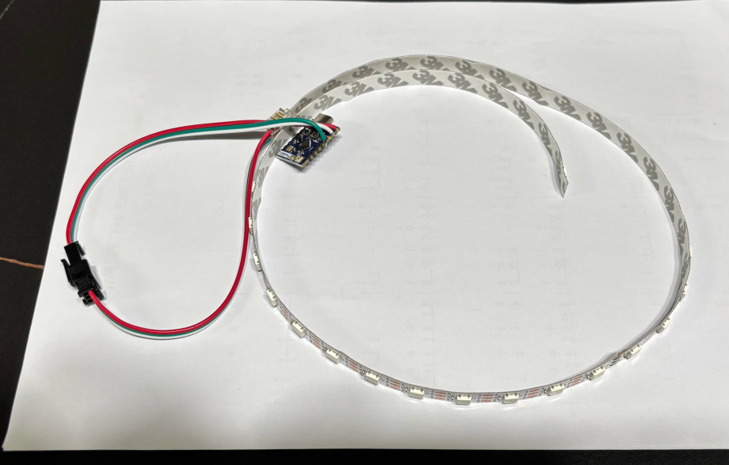

## 3. 用电脑刷写固件

建议使用电脑上的 Chrome 或 Edge，并准备一根支持数据传输的 USB 线。

### 3.1 打开安装器

用 USB 数据线把主板连接到电脑，打开 [Suger RGB 网页安装器](https://rgb.sidluo.com/installer/)，点击 **“连接设备并安装”**。

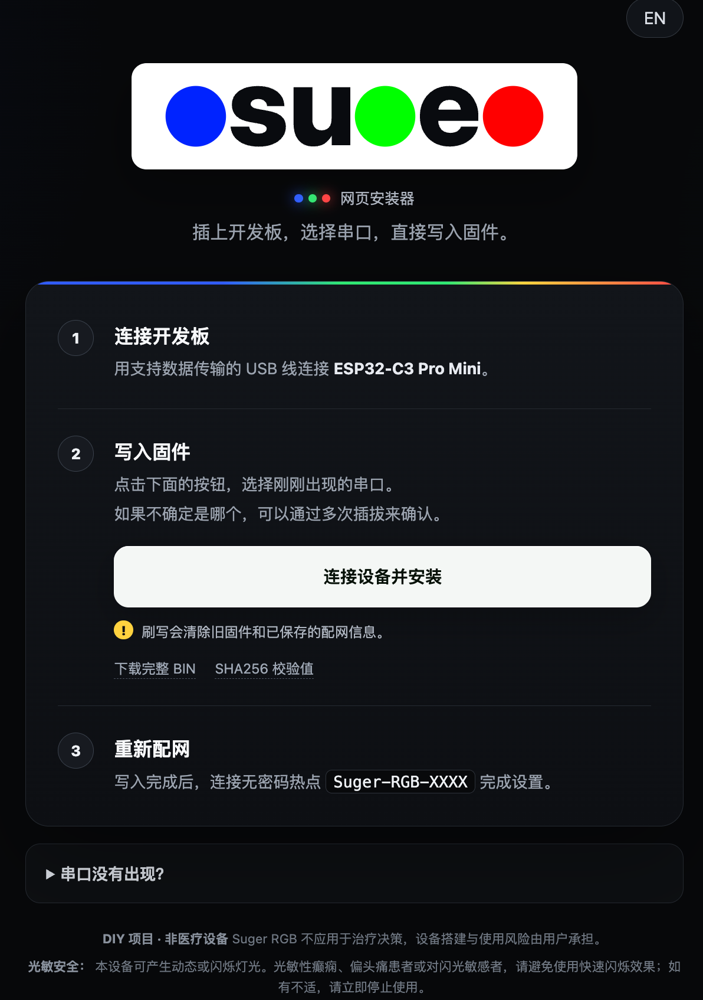

### 3.2 通过插拔确认串口

浏览器会弹出串口列表。如果不确定哪一个是主板，可以先拔下主板，再重新插入，观察哪个条目消失后又出现。**这个对照只在开始写入前进行。**

| 拔下主板 | 重新插入主板 |
| --- | --- |
| 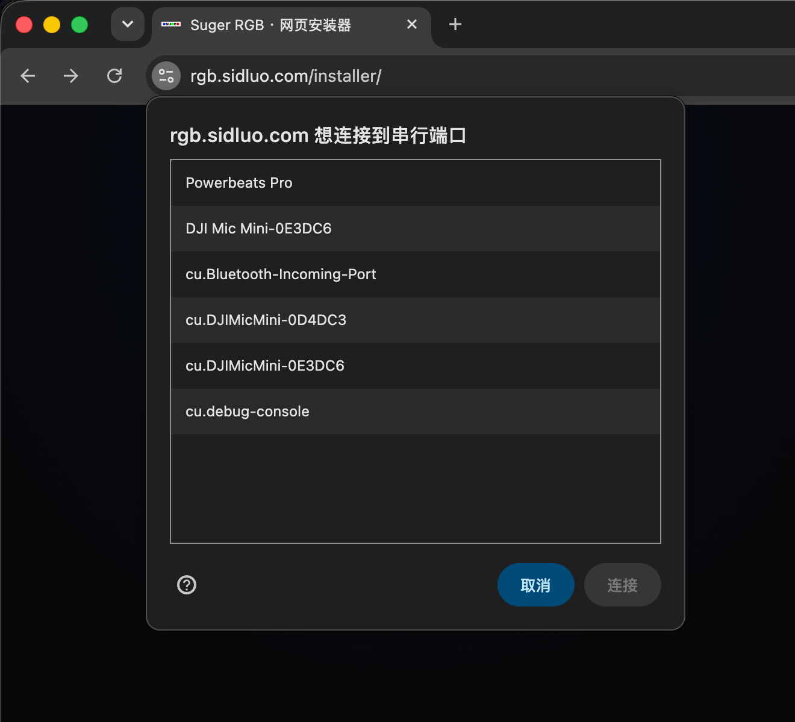 | 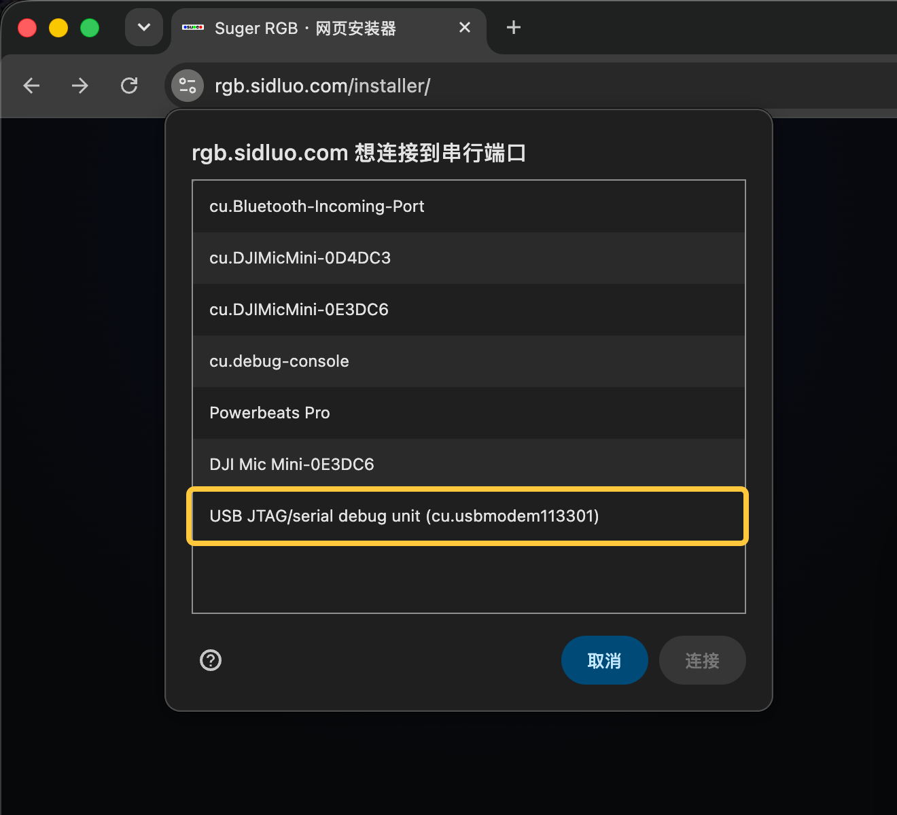 |
| 列表中没有主板的 USB 串口。 | 新增了 `USB JTAG/serial debug unit` 条目。 |

选择随插拔消失、重新出现的条目，再点击 **“连接”**。实际串口名称和编号因电脑而异，不必与截图中的编号一致。如果列表没有刷新，点击 **“取消”**，再点 **“连接设备并安装”** 重新查看。

### 3.3 选择安装

在弹窗中点击 **“安装 Suger RGB”**。

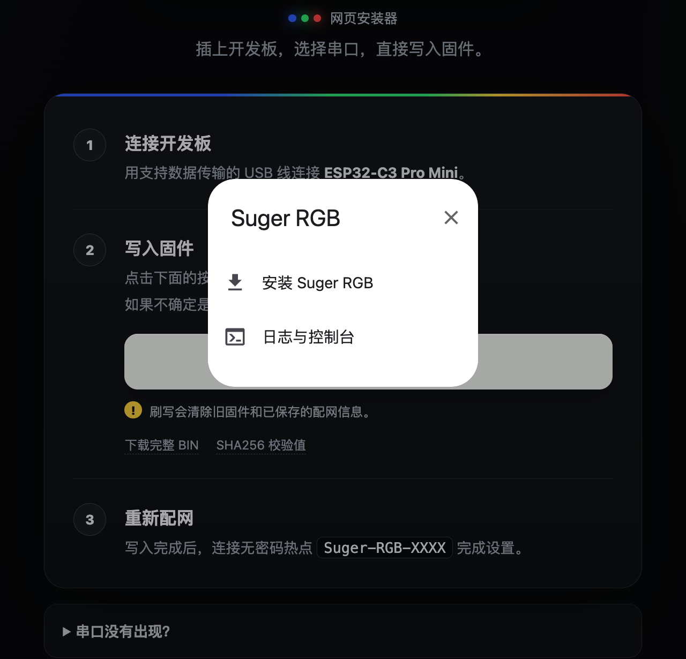

### 3.4 确认安装

确认后点击 **“安装”**。**本网页刷写会清除旧固件和已经保存的配网信息。**

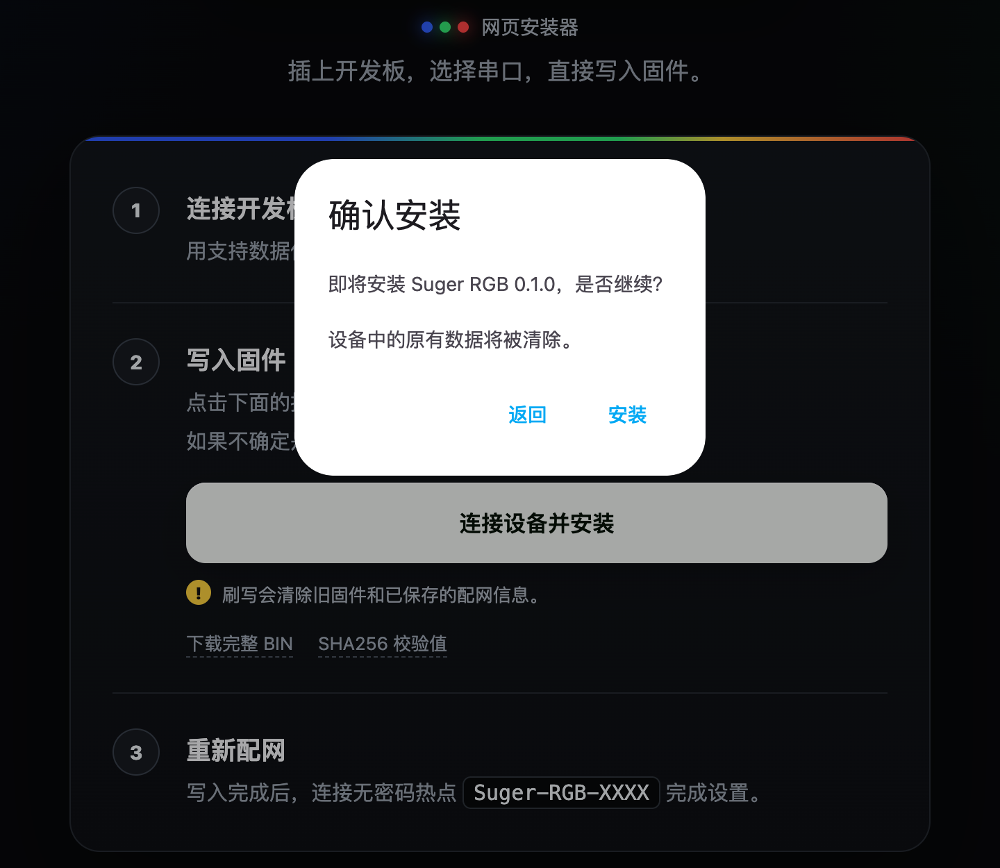

### 3.5 等待写入

保持页面打开，等待进度完成。写入期间不要拔下 USB 线。

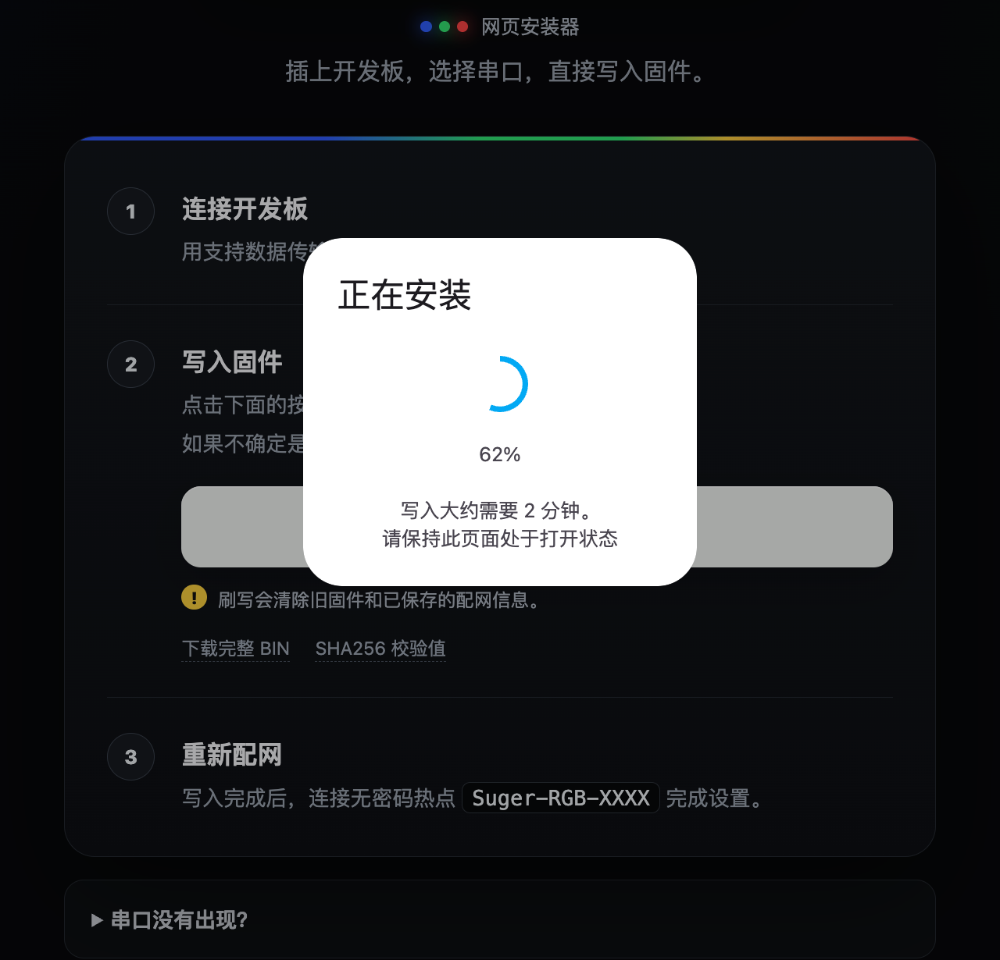

### 3.6 确认完成

看到 **“固件安装完成！”** 后，点击 **“下一步”**。

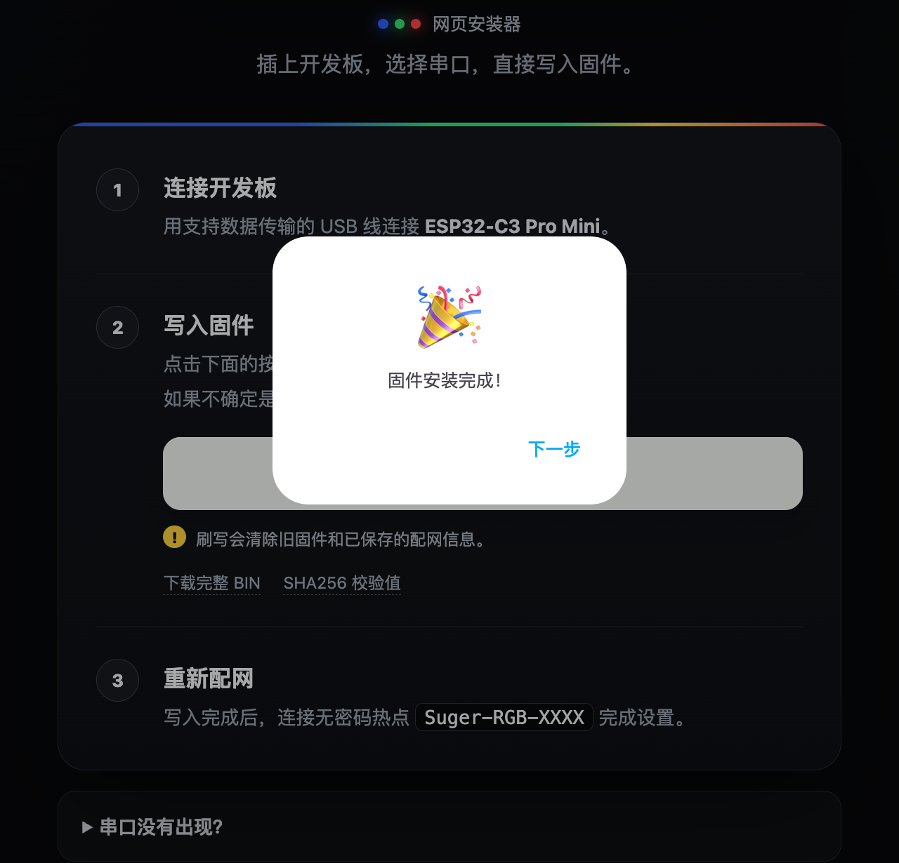

设备重启后会进入首次配网状态。接线正常的灯会显示低亮度白色跑马灯；接下来按[用手机完成配网](#4-用手机完成配网)连接 `Suger-RGB-XXXX` 热点。

如果提示“无法打开串口”，先看[串口打开失败](#串口打开失败)。只有页面明确报告安装完成，才算刷写完成；选到串口不等于已经写入。

## 4. 用手机完成配网

### 连接设备热点

尚未保存完整配网信息的设备，启动后会自动进入配网状态。已经配置过的设备，需要先[长按 BOOT 进入配网](#修改设置)。

1. 打开手机的 Wi-Fi 设置，连接 **`Suger-RGB-XXXX`**。末尾字符因设备而异，热点没有密码。
2. 手机若提示“无互联网连接”，选择继续连接。此时是手机在直接连接灯的设置页面。
3. 等待配网页弹出。没有自动弹出时，保持连接该热点，在浏览器地址栏输入 **`http://192.168.4.1/`**。

下面的 Wi-Fi 列表中已出现设备热点，点击 **`Suger-RGB-XXXX`** 即可连接。

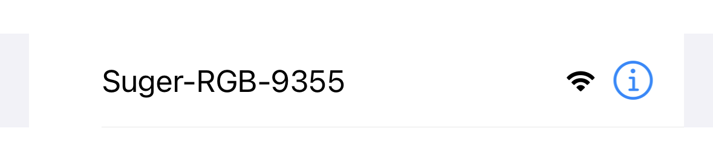

### 填写设置

配网页右上角可切换中文和英文。

| 页面项目 | 应填写什么 |
| --- | --- |
| Wi-Fi 名称 | 家中 **2.4 GHz Wi-Fi** 的名称，不是 `Suger-RGB-XXXX` |
| Wi-Fi 密码 | 上面这个家庭 Wi-Fi 的密码；开放网络可留空 |
| Nightscout 地址 | 例如 `https://example.com`，也可以只填 `example.com` |
| LED 灯珠数量（1–128） | 实际连接的灯珠总数，例如 8×8 灯板填写 `64` |
| 动态趋势提示 | 默认开启；关闭后，普通范围内只显示血糖颜色常亮 |

Nightscout 地址不需要手动添加 API 路径，设备会自动处理。当前只支持 HTTPS。

动态趋势开关不会关闭极低、极高血糖对应的特殊灯效，具体见[日常灯光含义](#5-日常灯光含义)。

### 测试灯效

点击 **“动态趋势提示”旁的 `!`** 展开测试区，再点击低／高血糖卡片或趋势箭头，查看实物灯效。再次点击 `!` 收起测试区，即可停止预览。

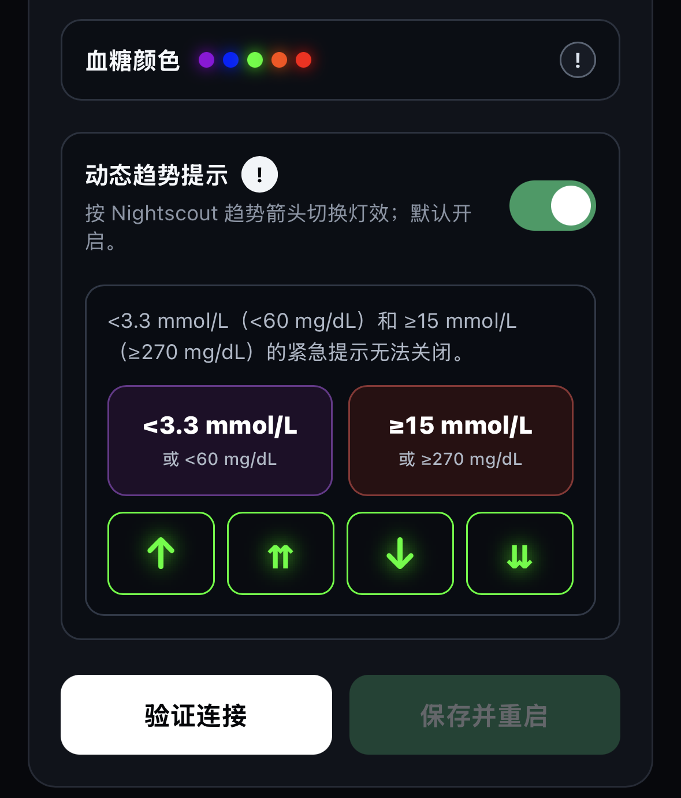

测试只预览灯效，不会修改 Nightscout 中的血糖记录。

### 验证并保存

1. 点击 **“验证连接”**。设备会尝试连接家庭 Wi-Fi，并向 Nightscout 请求血糖数据。
2. 验证成功后，页面会显示读到的血糖、数据时间和趋势。先确认这些信息符合预期。

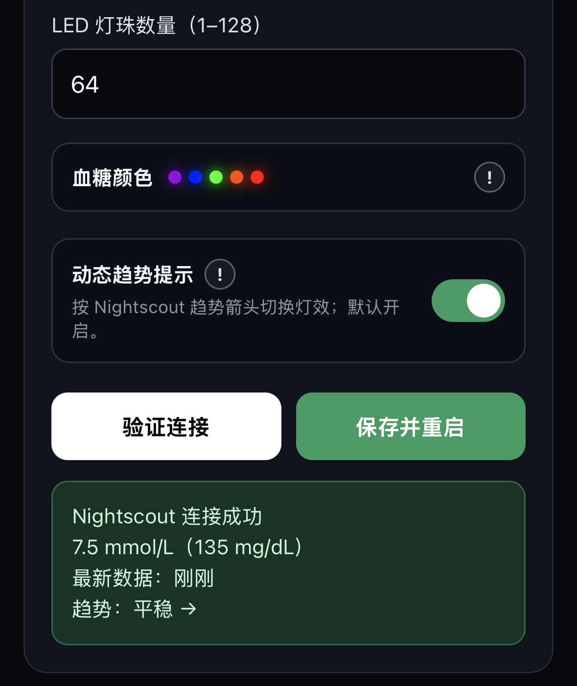

3. 点击 **“保存并重启”**。只验证、不保存，设置不会完成。
4. 等待设备重启。手机可以重新连接日常使用的 Wi-Fi。

**完成后应看到**：设备连接家庭 Wi-Fi，读到有效数据后按血糖和趋势显示灯光。正常运行时，配网热点和设置页面会关闭。

如果页面提示数据已经超过 10 分钟，即使能保存，灯也会显示白色呼吸。先检查 Nightscout 的数据更新情况。

## 5. 日常灯光含义

设备大约每分钟从 Nightscout 读取一次数据。灯光反映的是 Nightscout 已收到的记录，CGM 上传或网络延迟也会影响显示。

### 血糖颜色

| mmol/L | mg/dL | 颜色 |
| ---: | ---: | --- |
| `<3.5` | `<63` | 紫色 |
| `3.5–<4.4` | `63–79` | 蓝色 |
| `4.4–<8.5` | `80–152` | 绿色 |
| `8.5–<10` | `153–179` | 橙色 |
| `≥10` | `≥180` | 红色 |

### 趋势灯效

开启“动态趋势提示”时，普通范围内按下面的对应关系显示：

| Nightscout 趋势 | 灯光变化 |
| --- | --- |
| `↑` 上升 | 当前血糖颜色柔和呼吸 |
| `⇈` 快速上升 | 呼吸速度更快 |
| `↓` 下降 | 反向渐进填充 |
| `⇊` 快速下降 | 反向彗星 |
| `→`、`↗`、`↘` 或其他趋势 | 当前血糖颜色常亮 |

### 特殊显示

| 状态 | 灯光表现 |
| --- | --- |
| 血糖低于 `60 mg/dL`（约 `3.3 mmol/L`） | 紫色双脉冲，优先于普通趋势灯效 |
| 血糖达到 `270 mg/dL`（`15 mmol/L`）或以上 | 彩色闪烁（Twinklefox），优先于普通趋势灯效 |
| 刚启动还没读到数据，或数据已经过期 | 白色呼吸 |
| 正在配网 | 低亮度白色追逐（跑马灯） |
| 清除连接信息时 | 三次缓慢白光变化 |

极低、极高血糖的特殊灯效始终保留，关闭动态趋势提示也不会关闭它们。白色呼吸不是血糖区间颜色；正常运行中，数据超过 10 分钟未更新会进入这个状态。

设置保存后可以断开电脑，改用日常 USB 电源。断电不会清除设置，再次上电会自动连接已经保存的家庭 Wi-Fi。

## 6. 修改设置与重新配网

### 修改设置

更换家庭 Wi-Fi，或需要修改 Nightscout 地址、灯珠数量、动态趋势提示时：

1. 让设备正常通电。
2. 按住板上的 **BOOT 约 5 秒**，看到白色追逐后松开。
3. 手机连接 `Suger-RGB-XXXX`，打开配网页或 `http://192.168.4.1/`。
4. 修改设置，重新点击 **“验证连接”**，再点击 **“保存并重启”**。

如果 Wi-Fi 名称没有改变，密码框留空会继续使用已保存的密码。更换到另一个有密码的 Wi-Fi 时，需要填写新密码。

正常运行时，设备在家庭 Wi-Fi 中的 IP 不是管理入口。修改设置需要先用实体 BOOT 按键进入配网状态。

### 清除已保存的连接信息

只有想清除家庭 Wi-Fi 和 Nightscout 地址时，才需要以下操作：

1. 先按上面的步骤进入配网状态，并**完全松开 BOOT**。
2. 再次按住 BOOT 约 5 秒，看到三次缓慢白光变化后松开。
3. 设备会清除连接信息并重启，再次进入配网状态。

灯珠数量和动态趋势设置会保留。这是两次独立长按；一直按住同一次不会连续触发进入配网和清除信息。

## 7. 可选：打印主板保护壳

确认接线、刷写和配网都正常后，可以给主板加装保护壳。

模型来自 **Mattia Carli** 的 [MakerWorld 作品](https://makerworld.com/zh/models/2008412-case-for-esp32-c3-pro-mini-esp32-c3fh4#profileId-2163305)。原版把盒体和盖子放在同一个 STL 中，本项目另外提供了拆分文件：

- [原版：盒体和盖子在同一文件中](models/esp32-c3-pro-mini/Case_ESP32-C3_PRO_MINI_V01.stl)
- [单独的盒体](models/esp32-c3-pro-mini/Case_ESP32-C3_PRO_MINI_V01_Body.stl)
- [单独的盖子](models/esp32-c3-pro-mini/Case_ESP32-C3_PRO_MINI_V01_Lid.stl)

打印平台不接受组合文件时，分别上传盒体和盖子，两件都需要打印。这个模型只容纳主板；尺寸、拆分说明及原作者许可见[模型说明](models/esp32-c3-pro-mini/README.md)。

## 常见问题

### 串口打开失败

出现 `Failed to execute 'open' on 'SerialPort'` 或“无法打开串口”时，表示浏览器没能打开串口。它可能发生在写入前，也可能发生在写入后的重新连接阶段，单凭这条报错不能判断是否已写入。

1. 关闭安装对话框，以及其他正在连接该主板的刷写网页或串口工具。
2. 拔下主板，重新插入电脑，再点击“连接设备并安装”，重新选择串口。
3. 仍然失败时，换一根确认能传数据的 USB 线，直接连接电脑的另一个 USB 接口。

### 串口列表里没有主板

先确认 USB 线能传数据。如果仍不出现，可尝试进入刷写模式：拔掉 USB，按住 BOOT 后重新插入 USB，等待约两秒，再松开 BOOT，然后重新选择串口。

这是刷写恢复操作。日常重新配网时，应当先正常通电，再长按 BOOT。

更多串口、驱动和手动刷写步骤见[安装与刷写排查](INSTALL.md)。

### 搜不到 `Suger-RGB-XXXX`

已经配过网的设备，正常启动时不会一直显示热点。先让设备正常通电，再长按 BOOT 约 5 秒并松开，重新扫描手机 Wi-Fi。

如果仍搜不到，确认主板确实是 **Pro Mini**，把手机靠近设备，并尝试另一台手机。白色追逐表示设备正在进入配网流程，不能单凭灯效断定热点已成功广播。

如果电脑供电能搜到、换外部电源后搜不到，用同一根线分别测试两种电源，再尝试一组已知正常的电源和线，便于定位问题。

### 手机连上热点，但打不开页面

先确认手机仍连着 `Suger-RGB-XXXX`，没有自动切回家庭 Wi-Fi。必要时暂时关闭移动数据或“自动切换到可上网网络”，在浏览器地址栏输入 **`http://192.168.4.1/`**，不要输入到搜索框。

### 验证连接失败，或者保存按钮不能点击

保存前必须先验证成功；修改任何设置后都需要重新验证。

| 页面提示 | 先检查什么 |
| --- | --- |
| Wi-Fi 名称、密码错误或连接超时 | 家庭网络是否为 2.4 GHz，名称和密码是否正确，设备是否在信号范围内 |
| `401` / `403` | Nightscout 是否允许匿名读取数据；能打开网站首页不代表数据接口允许匿名读取 |
| Nightscout 超时或连接失败 | 地址、HTTPS 证书及家庭网络能否访问该站点 |
| 没有血糖数据或记录过期 | CGM 是否仍在向 Nightscout 上传，最新记录时间是否正常 |

如需用手机检查 Nightscout 网站本身，先让手机恢复正常联网；查完后再连接设备热点继续配网。

### 灯完全不亮，或只有一部分亮

先断电检查 `5V`、`GND` 和 `GPIO4 → DIN` 是否接对、接牢。通电后进入配网页，核对实际灯珠数量。首次配置前默认按 30 颗显示；超过 30 颗的灯具应在配网页填写实际数量。

如果仍有某一段不亮，继续检查那一段之前的接点和数据方向。不要把灯的输出端 `DOUT` 当成输入端。

### 灯一直白色呼吸

刚启动时可能还没读到第一条数据；如果一直这样，检查家庭 Wi-Fi 和 Nightscout。Nightscout 中的记录已经超过 10 分钟时，反复重启或刷写也不会让旧数据变新。

---

[返回项目首页](../README.md) · [网页安装器](https://rgb.sidluo.com/installer/) · [安装与刷写排查](INSTALL.md)
